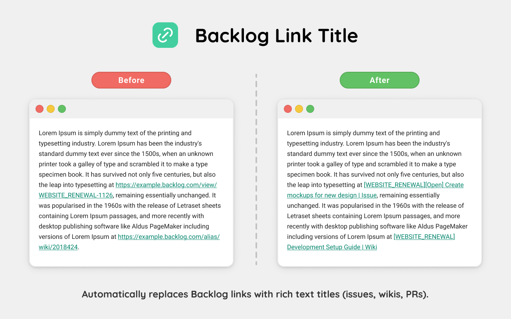

<h1 align="center">Backlog Link Title</h1>

A browser extension that automatically replaces Backlog link URLs with rich text titles showing project keys, status, and summaries for issues, wikis, and pull requests.

## 💿 Install

[link-chrome]: https://chromewebstore.google.com/detail/nfobmdefpbbmapinakmlecldokahkgaf "Chrome Web Store"
[link-firefox]: https://addons.mozilla.org/ja/firefox/addon/backlog-link-title/ "Firefox Browser Add-ons"

[][link-chrome]
[][link-chrome]

> Compatible browsers:
> [][link-chrome]
> [][link-chrome]
> [][link-chrome]
> [][link-chrome]

[][link-firefox]
[][link-firefox]

> Compatible browsers:
> [][link-firefox]

## 🛡️ License

MIT License
